  

  

 

  
  &nbsp;
  
  &nbsp;
  
  &nbsp;
  

---

I build open-source infrastructure for problems that don't have good solutions yet.

[**Acachete Labs**](https://acachete.xyz) is my software laboratory - operating at the intersection of blockchain, ZK cryptography, and AI infrastructure, in the gap where most tooling is still missing or out of reach.

---

## Featured Projects

| Project | What it does | Impact |
|---|---|---|
| [**stellar-zk**](https://github.com/salazarsebas/stellar-zk) | Unified ZK DevKit for Soroban - Groth16, UltraHonk, RISC Zero on BN254 host functions | First full ZK toolchain for Stellar Protocol 25 |
| [**Cougr**](https://github.com/salazarsebas/Cougr) | ECS framework for on-chain games - ZK proof flows, commit-reveal, account abstraction | 46+ forks · 30+ contributors · non-dilutive funding |
| [**Akkuea**](https://github.com/salazarsebas/akkuea) | Real-world asset infra on Stellar - fractional property tokenization, contract-level KYC/AML | 230+ forks · 200+ contributors · funded via Drips |
| [**Quasar**](https://github.com/salazarsebas/Quasar) | Declarative scripting language that compiles to Soroban contract invocations | Ships XDR encoding + ABI type checking in one CLI |
| [**PromptOS**](https://github.com/salazarsebas/PromptOS) | LLM cost-efficiency stack - caching, compression, complexity-based model router | Cuts inference costs across providers |
| [**Zylith**](https://github.com/salazarsebas/Zylith) | Shielded Concentrated Liquidity MM for Bitcoin on Starknet | RE{DEFINE} Starknet hackathon winner |

---

## Stack

  
    
  
  &nbsp;
  
  &nbsp;
  
  &nbsp;
  

---

## Currently Building

- [`stellar-zk`](https://github.com/salazarsebas/stellar-zk) - extending ZK proof verification for Soroban on Protocol 25
- [`Cougr`](https://github.com/salazarsebas/Cougr) - ECS game engine primitives for fully on-chain games
- [`PromptOS`](https://github.com/salazarsebas/PromptOS) - LLM cost optimization layer across inference providers

---

## Stats

  

  

---

## Contribution Graph

  <picture>
    <source media="(prefers-color-scheme: dark)" srcset="https://raw.githubusercontent.com/salazarsebas/salazarsebas/output/github-contribution-grid-snake-dark.svg"/>
    <source media="(prefers-color-scheme: light)" srcset="https://raw.githubusercontent.com/salazarsebas/salazarsebas/output/github-contribution-grid-snake.svg"/>
    
  </picture>

---

## Find Me

  
  &nbsp;
  
  &nbsp;
  

 

  ¡ tuanis bro 🇨🇷 !

